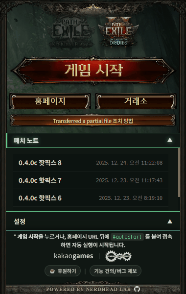

<!-- prettier-ignore-start -->
[![Chrome Web Store][chrome-web-store-version-badge]][chrome-web-store-link]
[![Chrome Web Store Users][chrome-web-store-users-badge]][chrome-web-store-link]

| GitHub Release                                                 | Build Status                                             | License                                                        | Sponsors                                                          | Buy Me a Coffee                                                   |
|----------------------------------------------------------------|----------------------------------------------------------|----------------------------------------------------------------|-------------------------------------------------------------------|-------------------------------------------------------------------|
| [![GitHub release][github-release-badge]][github-release-link] | [![Build Status][build-status-badge]][build-status-link] | [![GitHub license][github-license-badge]][github-license-link] | [![GitHub sponsors][github-sponsors-badge]][github-sponsors-link] | [![Buy Me a Coffee][buy-me-a-coffee-badge]][buy-me-a-coffee-link] |

<!-- prettier-ignore-end -->

<!-- Badges -->

[chrome-web-store-version-badge]: https://img.shields.io/chrome-web-store/v/cpghdafmhbkggpehfhcdicaoponodbje?label=Chrome%20Web%20Store&logo=chromewebstore&style=for-the-badge&color=success
[chrome-web-store-users-badge]: https://img.shields.io/chrome-web-store/users/cpghdafmhbkggpehfhcdicaoponodbje?logo=chromewebstore&style=for-the-badge&color=success
[github-release-badge]: https://img.shields.io/github/v/release/NERDHEAD-lab/POE2-quick-launch-for-kakao?logo=github
[build-status-badge]: https://github.com/NERDHEAD-lab/POE2-quick-launch-for-kakao/actions/workflows/release-please.yml/badge.svg
[github-license-badge]: https://img.shields.io/github/license/NERDHEAD-lab/POE2-quick-launch-for-kakao
[github-sponsors-badge]: https://img.shields.io/github/sponsors/NERDHEAD-lab?logo=github&logoColor=white
[buy-me-a-coffee-badge]: https://img.shields.io/badge/Buy%20Me%20a%20Coffee-yellow?logo=buymeacoffee&logoColor=white

<!-- Links -->

[chrome-web-store-link]: https://chromewebstore.google.com/detail/cpghdafmhbkggpehfhcdicaoponodbje?utm_source=item-share-cb
[github-release-link]: https://github.com/NERDHEAD-lab/POE2-quick-launch-for-kakao/releases
[build-status-link]: https://github.com/NERDHEAD-lab/POE2-quick-launch-for-kakao/actions
[github-license-link]: https://github.com/NERDHEAD-lab/POE2-quick-launch-for-kakao/blob/master/LICENSE
[github-sponsors-link]: https://github.com/sponsors/NERDHEAD-lab
[buy-me-a-coffee-link]: https://coff.ee/nerdhead_lab

# POE2 Quick Launch for Kakao



Kakao Games의 Path of Exile (1 & 2) 웹 실행을 간소화하고 자동화하는 크롬 확장 프로그램입니다.
번거로운 홈페이지 접속, 게임 시작 버튼 찾기, 모달 닫기 과정을 자동으로 처리하여 빠르게 게임에 진입할 수 있도록 돕습니다.

## 주요 기능

- **원클릭 게임 실행**: 확장 프로그램 팝업에서 바로 게임 실행 (POE 1, POE 2 지원)
- **자동 시작 처리**: `#autoStart` 기능을 통해 홈페이지 로딩 후 자동으로 "게임 시작" 버튼 클릭
- **스마트 탭 관리**: 게임 실행 후 자동으로 홈페이지 탭을 닫거나 정리 (설정 가능)
- **보안 센터 자동 패스**: "지정 PC 등록" 등 보안 확인 버튼 자동 감지 및 클릭
- **플러그인 제어**: 필요에 따라 플러그인 기능 일시 정지/재개

## 개발 및 설치 가이드

이 프로젝트는 Vite + React + TypeScript 기반의 크롬 확장 프로그램입니다.

### 요구 사항

- Node.js 24+ (프로젝트 루트의 `.npmrc`에 의해 버전이 강제됩니다.)
- npm

### 설치 및 로드 방법

1. **프로젝트 클론 및 의존성 설치**:

    ```bash
    git clone https://github.com/NERDHEAD-lab/POE2-quick-launch-for-kakao.git
    cd POE2-quick-launch-for-kakao

    # .nvmrc를 사용하여 권장 Node.js 버전으로 전환 (nvm 설치 시)
    nvm use

    npm install
    ```

2. **빌드**:

    ```bash
    npm run build
    # 또는 변경 사항 실시간 감지 (개발 모드)
    npm run dev
    ```

    위 명령어를 실행하면 `dist` 폴더에 확장 프로그램 파일이 생성됩니다.

3. **브라우저에 확장 프로그램 로드**:
    - **Chrome / Edge / Whale 등 크로미움 기반 브라우저**에서 주소창에 `chrome://extensions/` 입력
    - 우측 상단 **"개발자 모드"** 스위치 켜기
    - 좌측 상단 **"압축해제된 확장 프로그램을 로드합니다"** 클릭
    - 프로젝트 폴더 내의 `dist` 폴더 선택

### 코드 스타일 및 컨트리뷰션 가이드

이 프로젝트는 코드 품질 유지를 위해 **ESLint**, **Prettier**, **Husky**를 사용합니다.

- **자동 포맷팅 (Git Hooks)**: 커밋 시(`git commit`) 자동으로 변경된 파일(Staged)에 대해 포맷팅 및 검사를 수행합니다.
- **수동 포맷팅**:
    ```bash
    npm run format # 전체 파일 정리 (Prettier)
    npm run lint   # 코드 규칙 검사 (ESLint)
    ```
- **VS Code 설정 (자동 적용)**:
    - 프로젝트에 포함된 `.vscode/settings.json`을 통해 **저장 시 자동 포맷팅(Format On Save)**이 기본으로 적용됩니다.
    - 별도의 설정 없이 파일을 저장하기만 하면 코드가 자동으로 정리됩니다.

## 지원 및 문의

- [자주 묻는 질문 (FAQ)](docs/FAQ.md)
- [버그 제보 및 개선 요청 (Github)](https://github.com/NERDHEAD-lab/POE2-quick-launch-for-kakao/issues)
- [오픈 카카오톡](https://open.kakao.com/o/sK3FU2Fh)

## 기술 스택

- **Framework**: React, Vite
- **Language**: TypeScript
- **Style**: CSS (Vanilla)

## 라이선스

[MIT](LICENSE) | [개인정보 처리방침 (Privacy Policy)](docs/PRIVACY_POLICY.md)
