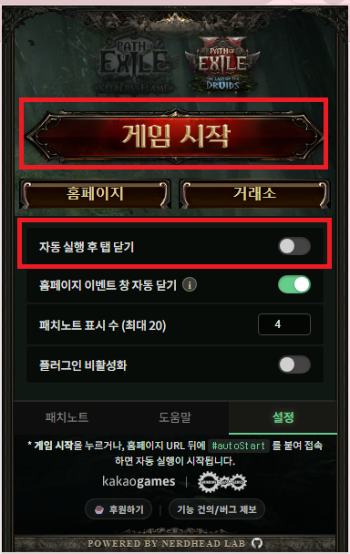
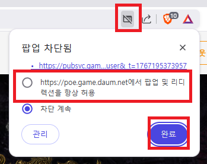
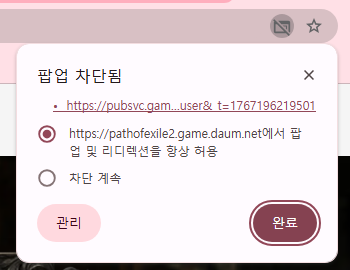
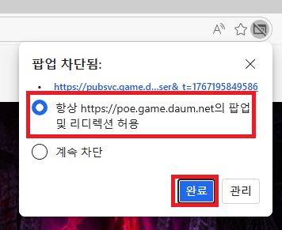
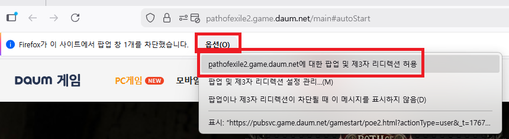

# 자주 묻는 질문 (FAQ)

이 문서는 **POE2 Quick Launch for Kakao** 확장 프로그램 사용에 관한 자주 묻는 질문들을 모아둔 것입니다.

## 일반

### Q: 이 프로그램은 무엇인가요?
**A:** 카카오게임즈 패스 오브 엑자일(POE) 홈페이지 접속 시, 번거로운 **게임 시작 버튼 클릭**, **보안 확인**, **팝업 닫기** 등을 자동으로 처리하여 빠르게 게임에 진입할 수 있도록 돕는 **크롬 확장 프로그램**입니다.

### Q: 공식 프로그램인가요?
**A:** 아니요. 이 프로그램은 [NERDHEAD LAB](https://github.com/NERDHEAD-lab/POE2-quick-launch-for-kakao)에서 개발한 **비공식 오픈소스 도구**입니다. 카카오게임즈와는 무관합니다.

### Q: 바이러스나 해킹 위험은 없나요? (개인정보 처리 방침)
**A:** 본 프로그램은 소스 코드가 GitHub에 투명하게 공개된 **오픈소스 프로젝트**이며, 어떠한 악성 코드도 포함하고 있지 않습니다.

또한, **Chrome 웹 스토어**의 **개인정보 보호(Privacy practices)** 탭을 통해 개발자의 개인정보 처리 방침이 투명하게 공개되어 있습니다.
이 방침은 **법적 효력**을 가지며, 이를 준수하지 않을 경우 스토어 퇴출 및 법적 구속력을 가질 수 있는 엄격한 규정입니다. 본 프로그램은 사용자의 민감한 개인정보를 수집하거나 외부 서버로 전송하지 않음을 약속드립니다.

*그래도 불안하시다면, GitHub에 공개된 소스 코드를 **AI(ChatGPT, Claude 등)에게 분석**시켜 안전성을 직접 확인하시거나, README의 빌드 가이드를 통해 **직접 빌드하여 사용**하실 수도 있습니다.*

### Q: 플러그인을 통해 게임 시작 할 경우 팝업 차단이 발생해요
**A:** 브라우저의 **팝업 차단 기능** 또는 **광고 차단 확장 프로그램**(유니콘 Pro 등) 때문일 수 있습니다.

게임 실행 과정에서 새 창(런처 실행 확인 등)을 띄울 때, 브라우저가 이를 팝업으로 인식하여 차단하는 경우가 있습니다. 

**해결 방법:**
우선 **플러그인 설정**에서 **"자동 실행 후 탭 닫기"**를 잠시 **체크 해제(OFF)** 해주세요.

그 다음, 플러그인에서 **게임 시작**을 눌러 홈페이지가 새 탭으로 뜬 상태에서 주소창을 확인해 주세요.
아래 브라우저별 해결 방법을 참고하여 **팝업 및 리디렉션**을 허용할 수 있습니다.

#### 1. Brave (브레이브)
주소창 우측의 **사자 아이콘(Brave Shields)** 클릭 -> '차단 설정' 확인

#### 2. Chrome / Edge (크롬, 엣지)
주소창 우측의 **'팝업 차단됨' 아이콘** 클릭 -> **'항상 허용'** 선택 후 완료

#### 3. Firefox (파이어폭스)
주소창 좌측의 **방패 아이콘** 또는 알림 줄의 **'옵션'** 클릭 -> **'팝업 허용'** 선택

---
또한, **유니콘 Pro(Unicorn Pro)** 등의 광고 차단 확장 프로그램이 설치되어 있다면, POE 홈페이지를 예외 목록에 추가하거나 잠시 비활성화해 주시기 바랍니다.
